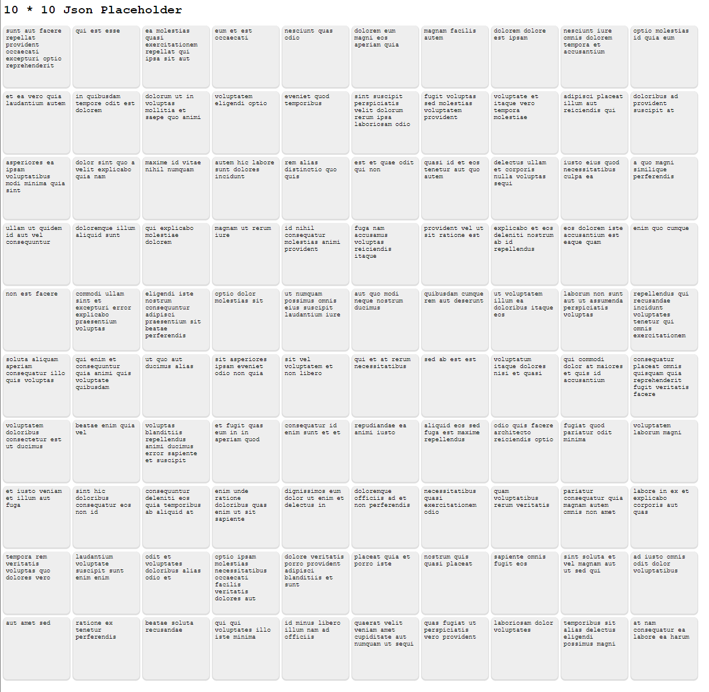

# JsonPlaceholder

## Overview

This project was generated with [Angular CLI](https://github.com/angular/angular-cli) version 16.2.10.

This application uses [jsonplaceholder](https://jsonplaceholder.typicode.com/) API to fetch [100 posts](https://jsonplaceholder.typicode.com/posts).

### The challenge

- All posts are rendered in a separate component and showed as squares, 10 rows x 10 columns.
- By default, the post title is shown.
- When clicking on a square, the title will be replaced with the userId.
- When clicking again, the Id will be shown and so on...



## My process and what I learned

The design idea is based from a Calendar and a Launchpad (novation). But I decided to keep it simple because RGB colors just seems too much.

1. Created the app with CLI command `ng new json-placeholder`
2. Created the json-placeholde.service.ts with Post model
3. Added the Posts and Post component with basic function
4. Install NgRx Dependencies
5. Define State:
   ```js
   export interface PostsState {
     posts: {
       isLoading: boolean,
       value: Post[],
       error?: any,
     };
   }
   ```
6. Define Actions:
   For loading posts handling errors, and showing next item for each post
7. Define Reducers:
   For handling state changes based on the actions
8. Define effects:
   The effect will update the posts response to have display index for each post object.
9. Update components and service:
   The Post component needs a Post input. The `displayedContent` method will then get the correct item to be displayed based on the displayed context using a switch statement.
   The `nextContent()` method dispatrches the `showNextContent` action which is handled by reducer in the store. This is to decouple the component from the state management logic.
   I also added selectors to get the PostsState from the store as well as isLoading and isError for displaying different states in the template.
10. Retest(s) and refactor(s)

I made the Posts component template so that when we load the page, the loading state will be displayed before the request is completed. And when the request failed, the error state will be displayed.

```html
<p *ngIf="(isLoading$ | async); else loaded" class="loading">Loading...</p>

<ng-template #loaded>
  <div *ngIf="(posts$ | async) as posts" class="posts-container">
    <app-post *ngFor="let post of posts" [post]="post"> </app-post>
  </div>

  <div *ngIf="(isError$ | async) " class="error-container">
    <h3>Oops! Something went wrong. Please try again.</h3>
    <button (click)="reloadPage()">Reload page</button>
  </div>
</ng-template>
```

### Continued development

- Unit tests
- improve on design and user experience (_Art is never finished, only abandoned_ - Leonardo da Vinci)

## Development server

Run `npm i` and then `npm start`. Navigate to `http://localhost:4200/`.

The application will automatically reload if you change any of the source files.

## Further help

To get more help on the Angular CLI use `ng help` or go check out the [Angular CLI Overview and Command Reference](https://angular.io/cli) page.
